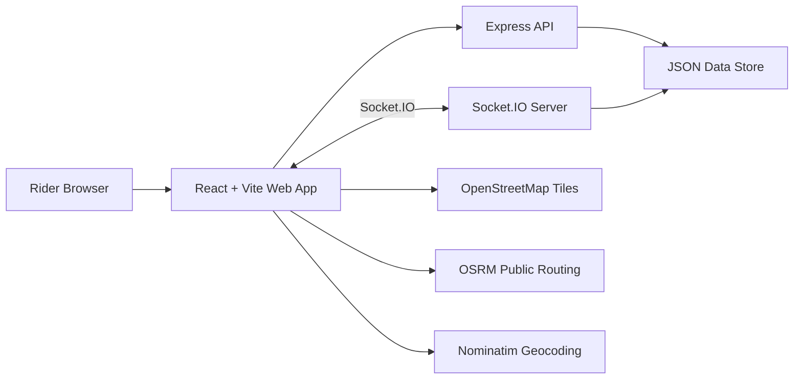

# ApexMoto Architecture

ApexMoto is a full-stack motorcycle companion app designed around four operational surfaces:

- Ride: route planning, GPX import/export, live ride tracking, telemetry, and incident controls.
- Crew: ride rooms, invite codes, rider roster, captain/sweep roles, and live broadcast state.
- Safety: incident command, emergency contacts, call/text actions, and ride journal.
- Garage: bike readiness, mileage, tire wear, service intervals, and maintenance tasks.

## System Overview



## Frontend

The frontend lives in `apps/web`.

Core libraries:

- React for application state and UI.
- React Leaflet and Leaflet for maps.
- Socket.IO Client for live group ride updates.
- date-fns for relative timestamps.
- lucide-react for iconography.
- Vite for development and production builds.

State is currently held in React component state, with localStorage used for rider profile, active group, and unsaved breadcrumb recovery.

## Backend

The backend lives in `apps/api`.

Core libraries:

- Express for HTTP APIs.
- Socket.IO for live position, group, and incident updates.
- nanoid for generated ids.
- File-backed JSON persistence for local development and single-node demos.

The API validates required payload fields and normalizes numeric fields before persistence.

## Persistence

Local persistence uses:

```text
apps/api/data/apexmoto.json
```

This file is intentionally ignored by Git. For production, replace this with a managed database such as Postgres, Neon, Supabase, or another durable store.

## Realtime Model

Clients join a group room by invite code. Rider position updates are broadcast only to the matching room. Incident updates are broadcast globally so safety dashboards stay current.

## External Services

ApexMoto currently uses public, unauthenticated services:

- OpenStreetMap tile servers
- Nominatim geocoding
- OSRM routing

For production traffic, replace these with paid/hosted map services or self-hosted infrastructure that supports your expected usage and terms.

## Deployment Shape

`vercel.json` defines a Vercel Services layout:

- `web` at `/`
- `api` at `/api`

The current local app uses `VITE_API_URL=http://localhost:4173` by default. For deployment, configure the frontend API URL to the deployed API route or service URL.
